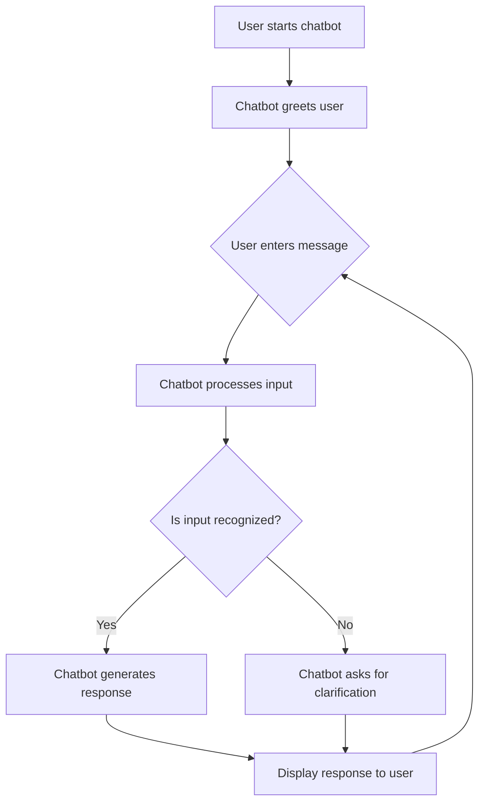

# Chatbot

A simple Python-based chatbot project for learning, experimentation, and further enhancement.

## Features

- Responds to user queries
- Supports basic conversation flow
- Easy to customize with new responses or logic

## Installation

Clone the repository:
```bash
git clone https://github.com/Haseeb-Ali663/chatbot.git
cd chatbot
```

Install required dependencies (if any):
```bash
pip install -r requirements.txt
```

## Usage Example

Run the chatbot:
```bash
python chatbot.py
```
You will be prompted to enter your message, and the chatbot will respond accordingly.

## Flowchart



## Customization

You can modify the chatbot’s logic and responses by editing `chatbot.py`. Add new functions or enhance conversation flow as needed.

## Contributing

Contributions are welcome! Please fork the repository and submit a pull request with your changes.

## License

This project is licensed under the MIT License.

## Author

[Haseeb-Ali663](https://github.com/Haseeb-Ali663)
